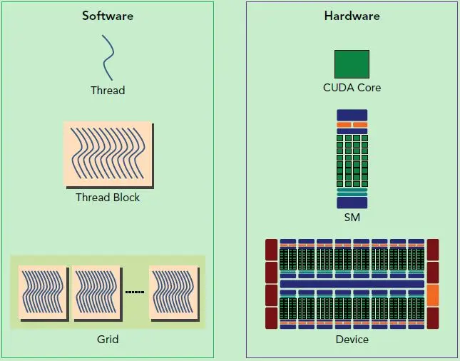
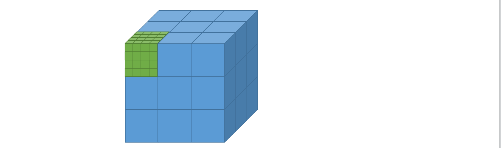
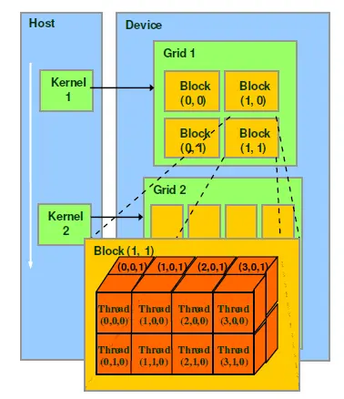

# make some attempts by using cuda and c++

# NVCC(NVIDIA CUDA Compiler)

# NCCL(NVIDIA Collective Communications Library) -- many gpus

# HOST_DEVICE FUNCTION
- __host__ : this function can only be called by host
- __global__: this function can be called by host,and executed through device by devcie
- __device__: this function can only be called by device

# gpu,sm,cuda core,warp scheduler,

- gpu device -> many sms -> many cudas -> warp scheduler -> 32 thread(32 cuda cores)

# grid, block, thread, warp

- One-dimensional
<<<nblock,nthread>>>
- two-dimensional
dim3 gridSize(3,3)
dim3 blockSize(3,3)
<<<gridSize,blockSize>>>
- three-dimensional
dim3 gridSize(3,3,3)
dim3 blockSize(3,3,3)
<<<gridSize,blockSize>>>

# simt,simd
- simt -- Concurrency, different data, same execution instructions
- simd -- Concurrency, different data, same execution instructions

